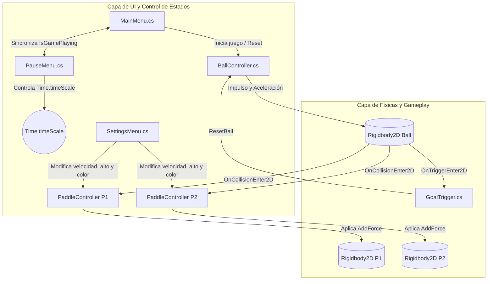
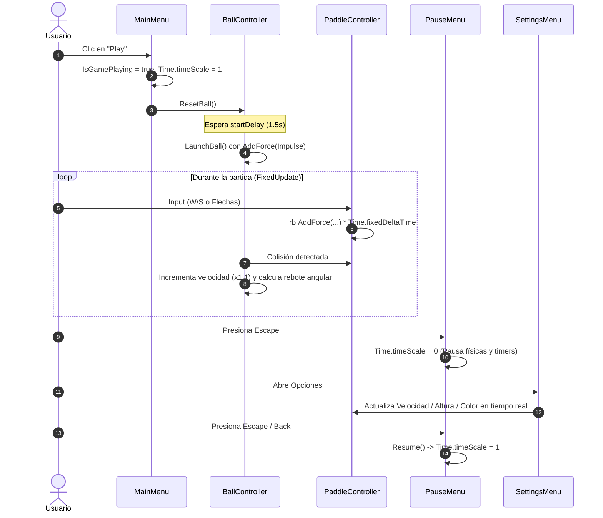

# 📐 Arquitectura del Sistema y Documentación de Clases

Este documento detalla en profundidad la **arquitectura de software**, el **flujo de ejecución**, los **modelos físicos y matemáticos** y la **especificación exhaustiva de cada clase** implementada en el proyecto Pong 2D.

---

## 🏛️ 1. Visión General de la Arquitectura

La solución está estructurada bajo el patrón de arquitectura basada en componentes (**Component-Based Architecture**) de Unity, dividiendo las responsabilidades en dos capas principales:

1. **Capa de Gameplay y Físicas (Simulation Layer):** Gestiona los cuerpos rígidos 2D (`Rigidbody2D`), colisiones, cálculo de fuerzas (`AddForce`), rebotes angulares y aceleración.
2. **Capa de UI y Control de Estado (Presentation & Flow Layer):** Gestiona el flujo entre el Menú Principal, Pausa, Opciones en tiempo real y la sincronización con los objetos de la escena.

---

## 🔄 2. Ciclo de Vida y Flujo de Ejecución

---

## 📦 3. Desglose Exhaustivo de Clases

---

### 🏓 3.1 `PaddleController.cs`

**Ubicación:** `Assets/TP02_C1_Scripts/PaddleController.cs`  
**Responsabilidad:** Controlar la simulación física de la paleta del jugador, la lectura de inputs, la restricción de límites dentro de la cancha y la exposición de interfaces de personalización (velocidad, tamaño y color).

#### Componentes Requeridos
- `[RequireComponent(typeof(Rigidbody2D))]`
- `SpriteRenderer` (en el mismo GameObject o hijo).

#### Variables y Campos

| Variable | Tipo | Acceso | Descripción |
| :--- | :--- | :--- | :--- |
| `speed` | `float` | `[SerializeField] private` | Magnitud de la fuerza aplicada al mover la paleta (Default: `15f`). |
| `upKey` | `KeyCode` | `[SerializeField] private` | Tecla asignada para desplazar hacia arriba (`W` o `UpArrow`). |
| `downKey` | `KeyCode` | `[SerializeField] private` | Tecla asignada para desplazar hacia abajo (`S` o `DownArrow`). |
| `usePositionClamping` | `bool` | `[SerializeField] private` | Si está activo, restringe la posición `Y` por código (Default: `true`). |
| `yBoundary` | `float` | `[SerializeField] private` | Límite vertical máximo y mínimo de la cancha (Default: `4.2f`). |
| `rb` | `Rigidbody2D` | `private` | Referencia al componente físico del objeto. |
| `spriteRenderer` | `SpriteRenderer` | `private` | Referencia al renderizador para cambio dinámico de color. |
| `verticalInput` | `float` | `private` | Valor acumulado de entrada vertical (`-1f`, `0f` o `1f`). |

#### Métodos Internos del Ciclo de Vida
- `Awake()`: Inicializa referencias a `Rigidbody2D` y `SpriteRenderer`. Configura `gravityScale = 0` y congela `FreezePositionX` y `FreezeRotation` para garantizar que la paleta solo se mueva en el eje vertical.
- `Update()`: Lee las teclas configuradas (`upKey` / `downKey`) de forma reactiva en el ciclo de renderizado.
- `FixedUpdate()`: Aplica la fuerza física en el bucle de físicas utilizando `Time.fixedDeltaTime`:
  $$\vec{F} = (0, \text{verticalInput} \times \text{speed} \times \Delta t_{\text{fixed}} \times 50)$$
  Si no hay input, aplica amortiguación lineal suave mediante `Mathf.Lerp` para evitar deslizamientos residuales. Finalmente, restringe la posición vertical mediante `Mathf.Clamp(pos.y, -yBoundary, yBoundary)`.

#### API Pública (Getters y Setters)
- `void SetSpeed(float newSpeed)` / `float GetSpeed()`: Modifica y consulta la velocidad de desplazamiento.
- `void SetPaddleHeight(float newHeight)` / `float GetPaddleHeight()`: Ajusta y consulta la escala en el eje `Y` (`transform.localScale.y`).
- `void SetPaddleColor(Color newColor)` / `Color GetPaddleColor()`: Modifica y consulta el color del `SpriteRenderer`.

---

### ⚽ 3.2 `BallController.cs`

**Ubicación:** `Assets/TP02_C1_Scripts/BallController.cs`  
**Responsabilidad:** Administrar la física de la pelota, el lanzamiento inicial temporizado, los rebotes con cálculo angular dinámico y la aceleración exponencial acumulativa por cada impacto contra las paletas.

#### Componentes Requeridos
- `[RequireComponent(typeof(Rigidbody2D))]`

#### Variables y Campos

| Variable | Tipo | Acceso | Descripción |
| :--- | :--- | :--- | :--- |
| `initialSpeed` | `float` | `[SerializeField] private` | Velocidad inicial de lanzamiento (Default: `8f`). |
| `speedIncreasePerHit` | `float` | `[SerializeField] private` | Multiplicador de velocidad acumulativo por cada impacto en paleta (Default: `1.1f` = +10%). |
| `maxSpeed` | `float` | `[SerializeField] private` | Velocidad terminal máxima permitida para evitar atravesar colliders (Default: `25f`). |
| `startDelay` | `float` | `[SerializeField] private` | Tiempo de espera en segundos antes de lanzar la pelota tras un reset (Default: `1.5f`). |
| `autoLaunchOnStart` | `bool` | `[SerializeField] private` | Si debe lanzarse en `Start()` sin esperar al menú (Default: `false`). |
| `currentSpeed` | `float` | `private` | Velocidad escalar actual de la pelota. |
| `startPosition` | `Vector2` | `private` | Coordenada inicial de spawn `(0, 0)`. |
| `launchCoroutine` | `Coroutine` | `private` | Control de la corrutina de lanzamiento activo. |

#### Métodos Clave y Modelo Físico/Matemático

1. `ResetBall()` / `ResetAndLaunchRoutine()`:
   - Detiene la velocidad lineal (`rb.linearVelocity = Vector2.zero`).
   - Posiciona la pelota en `startPosition`.
   - Espera `yield return new WaitForSeconds(startDelay)` (que respeta automáticamente si `Time.timeScale == 0`).
   - Invoca `LaunchBall()`.

2. `LaunchBall()`:
   - Genera una dirección horizontal aleatoria $\text{dirX} \in \{-1, 1\}$.
   - Genera un ángulo vertical moderado $\text{dirY} \in [-0.5, 0.5]$.
   - Aplica un impulso físico instantáneo:
     $$\vec{F}_{\text{impulse}} = \text{Normalize}(\text{dirX}, \text{dirY}) \times \text{currentSpeed}$$
     `rb.AddForce(launchDirection * currentSpeed, ForceMode2D.Impulse);`

3. `HandlePaddleBounce(Collision2D collision, PaddleController paddle)`:
   - **Aceleración por impacto:**
     $$v_{\text{nueva}} = \min(v_{\text{actual}} \times \text{speedIncreasePerHit}, v_{\text{max}})$$
   - **Rebote Angular Dinámico:** Se calcula la posición relativa de impacto respecto al centro de la paleta:
     $$\text{hitOffset} = y_{\text{pelota}} - y_{\text{paleta}}$$
     $$\text{normalizedHit} = \text{Clamp}\left(\frac{\text{hitOffset}}{\text{alturaPaleta} / 2}, -1.0, 1.0\right)$$
   - **Vector de salida resultante:**
     $$\vec{D} = \text{Normalize}(\text{signoX}, \text{normalizedHit})$$
     $$\vec{V}_{\text{lineal}} = \vec{D} \times v_{\text{nueva}}$$
   - Esto otorga al jugador control estratégico: golpear con los extremos de la paleta desvía la pelota con mayor inclinación, mientras que el centro la devuelve recta.

---

### 🥅 3.3 `GoalTrigger.cs`

**Ubicación:** `Assets/TP02_C1_Scripts/GoalTrigger.cs`  
**Responsabilidad:** Detectar mediante eventos de trigger cuando la pelota traspasa las líneas laterales de gol.

#### Variables y Métodos
- `isPlayer1Goal` (`bool`): Identifica a qué extremo de la cancha pertenece el arco.
- `OnTriggerEnter2D(Collider2D other)`: Evalúa si el objeto entrante contiene un `BallController`. De ser así, ejecuta `ball.ResetBall()`.

---

### 📋 3.4 `MainMenu.cs`

**Ubicación:** `Assets/TP02_C1_Scripts/MainMenu.cs`  
**Responsabilidad:** Gestionar la interfaz de inicio del juego, la navegación entre paneles principales y el inicio formal de la partida sincronizado con la física y la pelota.

#### Miembros Clave
- `public static bool IsGamePlaying { get; private set; }`: Variable de estado estática accesible globalmente para indicar si hay una partida en curso.
- `PlayGame()`:
  - Establece `IsGamePlaying = true`.
  - Oculta paneles de menú.
  - Reanuda el tiempo (`Time.timeScale = 1f`).
  - Llama a `ball.ResetBall()` para iniciar el conteo de saque.
- `ShowMainMenu()`: Muestra el menú principal, establece `IsGamePlaying = false` y congela el tiempo (`Time.timeScale = 0f`).
- `OnBackFromSubmenu()`: Si `!IsGamePlaying`, permite regresar al menú principal desde opciones o créditos.

---

### ⏸️ 3.5 `PauseMenu.cs`

**Ubicación:** `Assets/TP02_C1_Scripts/PauseMenu.cs`  
**Responsabilidad:** Controlar la suspensión del juego durante una partida activa, la captura de la tecla <kbd>Escape</kbd> y la jerarquía de regreso desde submenús sin colisionar con el Menú Principal.

#### Lógica de Navegación y Pausa
- En `Update()`, si `!MainMenu.IsGamePlaying`, ignora la tecla <kbd>Escape</kbd>.
- Si se presiona <kbd>Escape</kbd>:
  - Si hay un submenú abierto (Settings o Credits), invoca `BackToPauseMenu()` (cierra el submenú y regresa al menú de pausa).
  - Si la pausa está visible, ejecuta `Resume()` (`Time.timeScale = 1f`).
  - Si el juego está corriendo, ejecuta `Pause()` (`Time.timeScale = 0f`).
- `BackToPauseMenu()`: Restablece la vista del menú de pausa garantizando que `mainMenuPanel` permanezca desactivado.

---

### ⚙️ 3.6 `SettingsMenu.cs`

**Ubicación:** `Assets/TP02_C1_Scripts/SettingsMenu.cs`  
**Responsabilidad:** Administrar la configuración en tiempo real de velocidad, altura de paleta y color de los jugadores. Implementa un sistema de **auto-descubrimiento y vinculación automática** por código.

#### Mecanismo de Auto-Vinculación (`AutoFindReferences`)
1. **Detección de Paletas:** Utiliza `FindObjectsByType<PaddleController>()`. Compara las posiciones `X`: la paleta con menor `X` se vincula automáticamente como `player1` y la de mayor `X` como `player2`.
2. **Detección de Sliders y Textos:** Escanea los componentes hijos (`GetComponentsInChildren<Slider>` / `TextMeshProUGUI`) buscando coincidencias de nombres ("speed", "velocidad", "height", "alto", "p1", "p2").
3. **Detección de Botones de Color:** Auto-vincula botones con nombres que incluyan "color", "p1" y "p2".

#### Handlers y Paleta de Colores
- `UpdatePlayer1Speed(float)` / `UpdatePlayer2Speed(float)`: Conecta directamente con `PaddleController.SetSpeed()`.
- `UpdatePlayer1Height(float)` / `UpdatePlayer2Height(float)`: Conecta directamente con `PaddleController.SetPaddleHeight()`.
- `CyclePlayer1Color()` / `CyclePlayer2Color()`: Cicla secuencialmente a través de la paleta predefinida:
  $$\text{Blanco} \rightarrow \text{Azul} \rightarrow \text{Rojo} \rightarrow \text{Verde} \rightarrow \text{Amarillo} \rightarrow \text{Violeta} \rightarrow \text{Naranja}$$
  y actualiza la vista previa del color en la UI.

---

## 🏆 4. Patrones de Diseño y Buenas Prácticas Aplicadas

1. **Principio de Responsabilidad Única (SRP):** Cada clase tiene un dominio estrictamente delimitado (movimiento, pelota, triggers, menús de UI).
2. **Component-Based Architecture & `RequireComponent`:** Se asegura contractualmente la presencia de componentes obligatorios (`Rigidbody2D`) evitando errores de `NullReferenceException`.
3. **Física Determinista en `FixedUpdate`:** Todo cálculo de aceleración, fuerzas y clamping se ejecuta en el bucle de físicas sincronizado con `Time.fixedDeltaTime`.
4. **Programación Defensiva y Auto-Discovery:** `SettingsMenu` es tolerante a faltas de asignación manual en el Inspector, descubriendo las referencias de forma automática al instanciarse.
5. **Control de Estado Desacoplado:** El estado de juego se centraliza limpiamente a través de `MainMenu.IsGamePlaying`, evitando duplicaciones y conflictos entre el menú principal y el menú de pausa.
